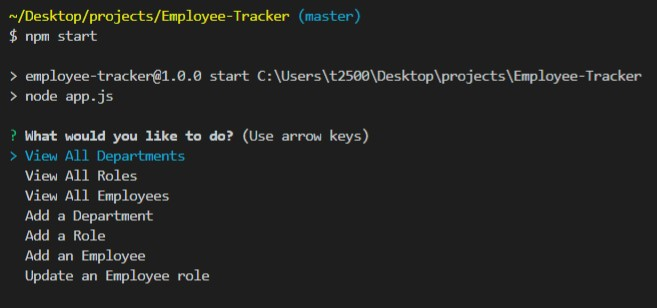
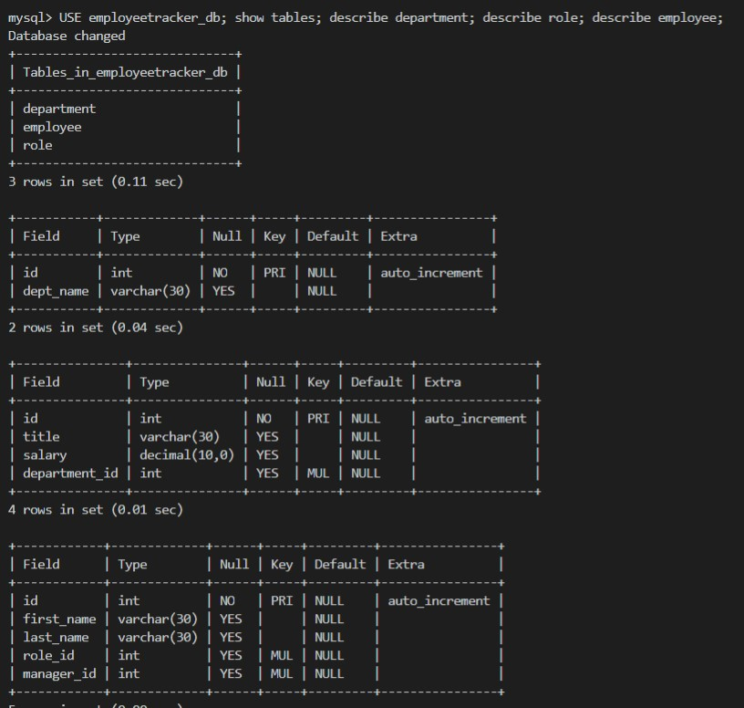
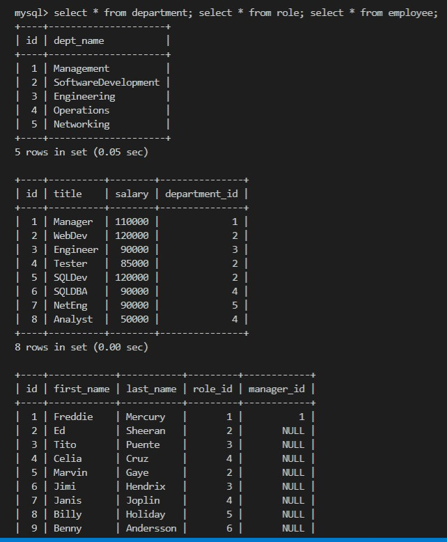

# Employee-Tracker
Command-line application to manage a company's employee database.

## GitHub repository
https://github.com/ktrnthsnr/Employee-Tracker

## Table of Contents
* [Description](#description)
* [Installations](#installations)
* [Usage](#usage)
* [Technology](#technology)
* [Contribution](#contribution)

## Description
This repo contains a simplified content management system (CMS) through a command-line application that manages a company's employee database. The application uses MySQL2 to connect to the MySQL database, Inquirer to gain user responses via the terminal, and console.table.pages to print MySQL rows to the console. The user will need to clone the application to their local drive, run the create database and tables script per the usage instructions below, seed the tables, then run the application via the command-line. Please see the Installation then Usage instructions provided below to start.

## Installations
- If cloning to your repository, to setup please follow these instructions:
- Prereq: install VSCode, Node.js
- After cloning the GitHub repo to your local drive, run the following in the VSCode command-line terminal
- Install npm
- $ npm init -y
- Install npm Inquirer, for more info https://www.npmjs.com/package/inquirer
- $ npm install inquirer
- Create a .gitignore file in the root and add node_modules to this file
- If you need to re-add the dependencies, run $ npm install
- Install MySQL anad MSQL2, create a pwd, then afterwards verify installed, $ mysql --version
- $ npm install -g mysql
- $ npm install mysql2 --save
- Install console.table to print MySQL in console
- $ npm install console.table --save

## Usage
- Within the VSCode terminal, start MySQL
-   $ mysql -u root -p
- Enter your MySQL password when prompted

- Create the database, tables and seed the tables
-   mysql> source ./db/schema.sql
-   mysql> source ./db/seeds.sql
-
- Run the application within the terminal
-   $ npm start
- 
-
- View how to invoke the app in the command-line and the queries behind them:
https://drive.google.com/file/d/1PDtzf94vUY6thJZZBh_offyvXtGPE1Zn/view

## Technology
Node.js, npm, Inquirer, MySQL, MySQL2, JavaScript, ES6, HTML, CSS

## Schema
- To view the database scheme from the terminal, initiate the MySQL command line, 
by typing:     *mysql -u root -p*    in your command line, then add your MySQL password when prompted.

- Check the database and tables were created by running in the MySQL command line,
* mysql> USE employeetracker_db; show tables; describe department; describe role; describe employee;
- You should see this result
- 

- Check the tables after seeding by running in the mysql command line,
* mysql> select * from department; select * from role; select * from employee;
- You should see this result
- 

## Contribution
ktrnthsnr

### ©️2020 ktrnthsnr
